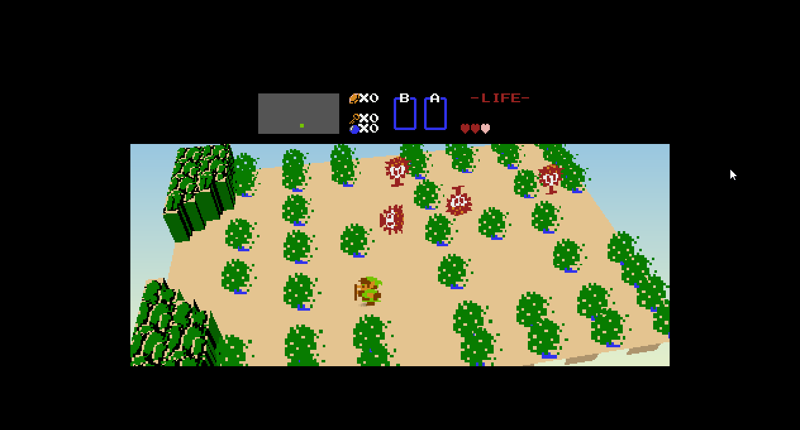

# LegendOfZeldaNESRecomp

> _This recompilation is a **byproduct of developing
> [nesrecomp](https://github.com/mstan/nesrecomp)** — the games are the proving ground, the framework is the goal.
> **These are in-development previews, not finished ports — expect rough
> edges**, and depth will keep landing over months, not days. My time for any
> one title is limited, so I ask for your patience. Contributions are welcome —
> testing, issues, and PRs to the game or framework all help and will
> accelerate this game's polish. More on the why at:
> [Recomp + AI: 5 Months Later »](https://1379.tech/recomp-ai-5-months-later/)_

Static recompilation of The Legend of Zelda (NES) for native PC.
Built with the [NESRecomp](https://github.com/mstan/nesrecomp) framework.

> **Status: Believed to be 100% playable.** Tested through the overworld and dungeon 7 without encountering issues. No known dispatch misses remain. If you find a bug, please open an issue.

## Acknowledgments

The complete dispatch function coverage was made possible by the [zelda1-disassembly](https://github.com/aldonunez/zelda1-disassembly) by Aldo Nunez. The disassembly's debug symbols were used to extract callable function addresses for the SRAM-mapped code region, closing the final dispatch gaps.

## What Works

- Overworld exploration with screen transitions
- Dungeons, bosses, and items
- Enemies and combat
- Caves (old man, merchants, dungeon entrances)
- Inventory / pause subscreen
- Battery-backed save persistence (`zelda.srm` next to executable)

## Quick Start

1. Download `LegendOfZeldaNESRecomp-windows-x64.zip` from [Releases](../../releases)
2. Extract and run `LegendOfZeldaNESRecomp.exe`
3. Select your Legend of Zelda (USA) ROM when prompted — the path is saved for future launches

## Controls

| NES Button | Keyboard |
|------------|----------|
| D-Pad      | Arrow keys |
| A          | Z |
| B          | X |
| Start      | Enter |
| Select     | Tab |

| Hotkey | Action |
|--------|--------|
| F5     | Toggle turbo (fast-forward) |
| F6     | Save state |
| F7     | Load state |
| Numpad 0 | Toggle Voxel 3D |
| Numpad 8 / 2 | Increase / decrease camera pitch |
| Numpad 4 / 6 | Orbit camera left / right (yaw) |
| Numpad 7 / 9 | Roll camera left / right |
| Numpad + / - | Zoom in / out |
| Numpad 1 / 3 | Shrink / enlarge assembled sprites |
| Numpad 5 | Reset the live camera rig to package defaults |

## Voxel 3D (experimental)

<p align="center">
  
</p>

Open **Mods** in the launcher and enable **Voxel 3D**. The bundled
feature is disabled by default and targets the verified stock PRG0 ROM. Camera
pitch, yaw, roll, zoom, and sprite scale can be saved as package options. The
numpad controls above provide temporary live experimentation; they do not
rewrite `mods/state.toml`. Title, registration, and inventory screens remain
flat and pillarboxed.

The default camera presents each room as a raised tabletop. Pitch changes how
far the camera looks down into the room; yaw orbits around the vertical axis;
roll tilts the horizon; zoom changes framing without changing the room; and
sprite scale adjusts assembled Link, enemy, item, and effect cards. Extreme
angles are intentionally available for experimentation, while Numpad 5 returns
the live camera to the package defaults.

Geometry comes from Zelda's live 32x22 `PlayAreaTiles` grid and its collision
classification. The original frame supplies tile textures, while current OAM
pieces are assembled into coherent camera-facing metasprite cards before
projection. Zelda's verified 2x2 tree metatiles become transparent,
camera-facing foliage cards; boundary rocks remain solid prisms. Every tree,
actor, pickup, weapon, projectile, and effect card receives a proportional
contact shadow. Native-room clipping and a Link-specific height cap prevent
transition-only OAM pieces from stretching over northern doors. Room scrolling
holds the last complete diorama while Zelda streams its next nametable, then
replaces it atomically with the completed destination room. The black HUD field
is extended across the widescreen frame while the original HUD remains centered
and pixel-perfect. This is a presentation-only trusted plugin: normal execution,
the stock ROM, saves, and launches with the feature disabled are unchanged.

## Building from Source

Requires Visual Studio 2022 and CMake 3.20+.

```bash
git clone https://github.com/mstan/LegendOfZeldaNESRecomp
cd LegendOfZeldaNESRecomp

# Windows
setup.bat

# Linux / macOS
chmod +x setup.sh && ./setup.sh
```

This initializes the pinned [nesrecomp](https://github.com/mstan/nesrecomp)
submodule and links the Nestopia oracle core.

Then build:

```bash
cmake -S . -B build -G "Visual Studio 17 2022" -A x64
cmake --build build --config Release
```

Place your `Legend of Zelda (USA).nes` ROM in the build directory or select it at runtime.

## Architecture

This is a **static recompiler**, not an emulator. The original 6502 machine code is translated to C at build time, then compiled to native x64. The NES PPU, APU, and mapper are simulated by the runner library.

- `game.cfg` — recompiler configuration (bank switch, inline dispatch, extra functions, extra labels)
- `extras.c` — game-specific hooks (SRAM persistence, entity diagnostics)
- `zelda_voxel.c` — Zelda tile-height profile and 3D view controls
- `generated/` — auto-generated C code (do not edit manually)
- `nesrecomp/` — framework submodule (recompiler + runner)

## Known Limitations

- Audio is basic (APU register writes are captured but full audio mixing is work-in-progress)

---

<p align="center">
  <sub><b>R.A.I.D. — Retro AI Development</b> · a Discord for AI-assisted retro reverse-engineering, decomp &amp; recomp</sub>
</p>

<p align="center">
  <a href="https://discord.gg/Ad9BwSzctP"></a>
</p>
