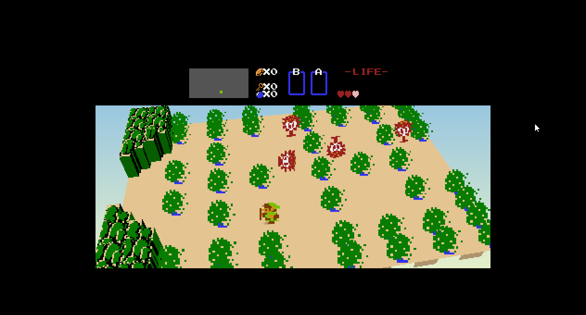

# LegendOfZeldaNESRecomp

> _This recompilation is a **byproduct of developing
> [nesrecomp](https://github.com/mstan/nesrecomp)** — the games are the proving ground, the framework is the goal.
> **These are in-development previews, not finished ports — expect rough
> edges**, and depth will keep landing over months, not days. My time for any
> one title is limited, so I ask for your patience. Contributions are welcome —
> testing, issues, and PRs to the game or framework all help and will
> accelerate this game's polish. More on the why at:
> [Recomp + AI: 5 Months Later »](https://1379.tech/recomp-ai-5-months-later/)_

Static recompilation of The Legend of Zelda (NES) for native PC.
Built with the [NESRecomp](https://github.com/mstan/nesrecomp) framework.

> **Cycle migration preview:** the cycle CPU is now the default source build, with the legacy backend still available. The earlier legacy build was tested through dungeon 7. Current cycle checks cover startup, an overworld route, save/replay and presentation modes; a new full-game audit is pending. See [CYCLE-MIGRATION.md](CYCLE-MIGRATION.md).

## Acknowledgments

The complete dispatch function coverage was made possible by the [zelda1-disassembly](https://github.com/aldonunez/zelda1-disassembly) by Aldo Nunez. The disassembly's debug symbols were used to extract callable function addresses for the SRAM-mapped code region, closing the final dispatch gaps.

## What Works

- Overworld exploration with screen transitions
- Dungeons, bosses, and items
- Enemies and combat
- Caves (old man, merchants, dungeon entrances)
- Inventory / pause subscreen
- Battery-backed save persistence (`saves/<ROM stem>.sav` beside the executable); older raw 8 KiB `.srm` progress imports through the launcher

## Quick Start

1. Download `LegendOfZeldaNESRecomp-windows-x64.zip` from [Releases](../../releases)
2. Extract and run `LegendOfZeldaNESRecomp.exe`
3. Select your Legend of Zelda (USA) ROM when prompted — the path is saved for future launches

## Controls

| NES Button | Keyboard |
|------------|----------|
| D-Pad      | Arrow keys |
| A          | Z |
| B          | X |
| Start      | Enter |
| Select     | Backslash |

| Hotkey | Action |
|--------|--------|
| Escape | Menu/settings |
| Tab | Hold fast-forward |
| F8 | Save cycle state |
| F9 | Load cycle state |
| F11 | Fullscreen |
| F12 | Screenshot |
| Numpad 0 | Toggle Voxel 3D |
| Numpad 8 / 2 | Increase / decrease camera pitch |
| Numpad 4 / 6 | Adjust camera yaw left / right |
| Numpad 7 / 9 | Roll camera left / right |
| Numpad + / - | Zoom in / out |
| Numpad 1 / 3 | Shrink / enlarge assembled sprites |
| Numpad 5 | Reset the live camera rig to package defaults |
| Right stick (first person) | Look horizontally and vertically |
| Left stick / D-pad / arrow keys (first person) | Move relative to the camera |

## Zelda Remastered HD Mod

The cycle build uses the original USA PRG0 ROM for every presentation mode.
Remastered is installed and selected through **Mods** in the same executable.
Create a local package from your existing Mesen pack:

```sh
python tools/import_hdpack.py --pack "/path/to/pack" --rom "/path/to/Legend of Zelda.NES" --out "Zelda-Remastered.nesmod"
```

Install that archive in the launcher's Mods page, then enable **Zelda Remastered
HD** before starting. It is disabled by default and shares an exclusion group
with voxel views. The framework verifies the pack's IPS and applies it to an
in-memory cartridge copy; your ROM stays unchanged. The included pack creator
notice is preserved. Texture/background presentation uses the original PPU;
replacement music and sound files remain unsupported. To return to stock,
disable the feature in the launcher and restart. Pack/patch selection is
read-only during gameplay, and save states require matching assets and options.

## Voxel 3D (experimental)

<p align="center">
  
</p>

Open **Mods** in the launcher and enable either **Voxel 3D Overworld (Experimental)** or
**Voxel 3D First Person (Experimental)**. The two presentation modes are mutually exclusive:
enabling one automatically disables the other. Both bundled features are
disabled by default and target the verified stock PRG0 ROM. Camera
pitch, yaw, roll, zoom, and sprite scale can be saved as package options. The
numpad controls above provide temporary live experimentation; they do not
rewrite `mods/state.toml`. Title, registration, and inventory screens remain
flat and pillarboxed.

The overworld camera presents each room as a raised tabletop. Pitch changes how
far the camera looks down into the room; yaw orbits around the vertical axis;
roll tilts the horizon; zoom changes framing without changing the room; and
sprite scale adjusts assembled Link, enemy, item, and effect cards. Extreme
angles are intentionally available for experimentation, while Numpad 5 returns
the live camera to the package defaults.

The first-person camera follows Link's live position and uses a two-stick
control model: the right stick owns continuous yaw and pitch, while the left
stick moves relative to the direction being viewed. D-pad and arrow-key input
use the same camera-relative mapping. Zelda's original movement remains
four-directional, so diagonal or off-axis intent is quantized to the nearest
native cardinal direction with a small hysteresis band to prevent jitter.
Temporary numpad yaw participates in that same mapping, so pressing forward
continues through the adjusted view instead of snapping the camera elsewhere.
Link's own card is hidden because the camera occupies it, while
enemies, weapons, pickups, effects, terrain, shadows, and the original HUD
remain visible. In this mode pitch looks up or down, yaw offsets the view from
the current heading, and zoom adjusts the field of view.

Geometry comes from Zelda's live 32x22 `PlayAreaTiles` grid and its collision
classification. The original frame supplies tile textures, while current OAM
pieces are assembled into coherent camera-facing metasprite cards before
projection. Zelda's verified 2x2 tree metatiles become transparent,
camera-facing foliage cards; boundary rocks remain solid prisms. Every tree,
actor, pickup, weapon, projectile, and effect card receives a proportional
contact shadow. Native-room clipping and a Link-specific height cap prevent
transition-only OAM pieces from stretching over northern doors. Room scrolling
holds the last complete diorama while Zelda streams its next nametable, then
replaces it atomically with the completed destination room. The black HUD field
is extended across the widescreen frame while the original HUD remains centered
and pixel-perfect. This is a presentation-only trusted plugin: normal execution,
the stock ROM, saves, and launches with the feature disabled are unchanged.

## Building from Source

Requires Visual Studio 2022 and CMake 3.20+.

```bash
git clone https://github.com/mstan/LegendOfZeldaNESRecomp
cd LegendOfZeldaNESRecomp

# Windows
setup.bat

# Linux / macOS
chmod +x setup.sh && ./setup.sh
```

This initializes the pinned [nesrecomp](https://github.com/mstan/nesrecomp)
and recomp-ui submodules. Cycle configuration generates native code directly from your supplied ROM.

Then build:

```bash
cmake -S . -B build-cycle -G "Visual Studio 17 2022" -A x64 -DNESRECOMP_ROM="F:/ROMs/Legend of Zelda.NES"
cmake --build build-cycle --config Release
```

Choose the same USA PRG0 ROM at runtime. Remastered uses the Mods importer above. For an explicit legacy build, see [CYCLE-MIGRATION.md](CYCLE-MIGRATION.md).

## Architecture

The original 6502 code is translated to cycle-aware C and compiled to native code. Unprofiled code and cartridge work-RAM code safely use the cycle interpreter. The PPU, APU and mapper advance with the guest CPU.

- `game-cycle-stock.toml` — default cycle target configuration
- `tools/import_hdpack.py` — shared framework HD-pack package importer with Zelda attribution
- `cyc_extras.c` / `cycle_bridge.h` — cycle presentation, input and diagnostics adapter
- `game.cfg` / `extras.c` — retained legacy configuration and hooks
- `zelda_voxel.c` — Zelda tile-height profile and 3D view controls
- `build-cycle/cycle-*` — generated cycle code (do not edit manually)
- `generated/` — retained legacy generated inputs
- `nesrecomp/` — framework submodule (recompiler + runner)

## Known Limitations

- Remastered preserves the existing sampler limitations for unsupported conditions or missing images. HD-pack replacement music and sound files remain unsupported.
- Legacy binary save states do not transfer to the cycle backend. Raw battery progress remains portable.
- Voxel views retain their existing experimental camera and geometry limitations.

## License

PolyForm Noncommercial 1.0.0 — see [`LICENSE`](LICENSE). Third-party
components retain their own licenses.

---

<p align="center">
  <sub><b>R.A.I.D. — Retro AI Development</b> · a Discord for AI-assisted retro reverse-engineering, decomp &amp; recomp</sub>
</p>

<p align="center">
  <a href="https://discord.gg/Ad9BwSzctP"></a>
</p>
